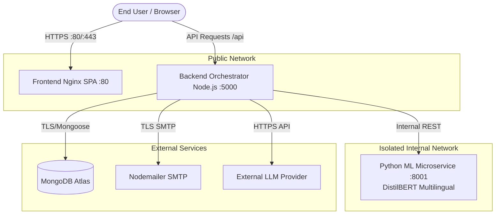

# VedAI 2.0 — Production Deployment & Operations Guide

## Architecture Overview



---

## 1. Quick Start (Docker Compose)

### Prerequisites
- Docker Engine 24+ & Docker Compose v2+
- 4GB+ available system RAM (for PyTorch DistilBERT model weights)

### Running the Stack
```bash
# From repository root:
docker compose -f deployment/docker-compose.yml up --build -d
```

### Checking Service Health
```bash
docker compose -f deployment/docker-compose.yml ps
```

All 3 containers (`vedai-ml-service`, `vedai-backend`, `vedai-frontend`) will show status `healthy`.

---

## 2. Environment Variables Specification

| Variable | Required | Default / Example | Purpose |
|:---|:---:|:---|:---|
| `NODE_ENV` | Yes | `production` | Enables production optimizations and disables debug logging |
| `PORT` | Yes | `5000` | Backend listening port |
| `MONGO_URI` | Yes | `mongodb+srv://...` | MongoDB database connection URI |
| `JWT_SECRET` | Yes | *(Random 64-char string)* | Cryptographic key for authenticating session tokens |
| `MODEL_API_URL` | Yes | `http://ml-service:8001/predict` | Internal network endpoint for the Python text ML engine |
| `FRONTEND_URL` | Yes | `https://vedai.app` | Base URL used in password reset emails |
| `CLIENT_URL` | Yes | `https://vedai.app` | CORS permitted origin |
| `SMTP_HOST` | Optional | `smtp.gmail.com` | Email delivery host |
| `SMTP_PORT` | Optional | `587` | Email delivery port |
| `SMTP_USER` | Optional | `alerts@vedai.app` | SMTP credentials username |
| `SMTP_PASS` | Optional | `...` | SMTP app password |

---

## 3. Production Hardening & Safety Checklist

- [x] **Network Isolation**: The `ml-service` container is attached **only** to the internal network (`vedai-internal: internal: true`) and is never reachable from public ingress.
- [x] **Non-Root Execution**: Both `Dockerfile.backend` and `Dockerfile.ml` drop root privileges and execute as unprivileged users (`vedai:1001` and `vedaiml:1001`).
- [x] **Signal Forwarding**: Node.js backend uses `dumb-init` to handle `SIGINT` and `SIGTERM` gracefully without leaving orphan processes.
- [x] **Static Asset Caching**: Nginx serves Vite build assets with aggressive immutable caching (`Cache-Control: public, no-transform; max-age=31536000`).
- [x] **Strict Security Headers**: Nginx injects `X-Content-Type-Options: nosniff`, `X-Frame-Options: SAMEORIGIN`, and `Referrer-Policy: strict-origin-when-cross-origin`.
- [x] **Zero Raw Frame Retention**: Docker containers do not mount camera volume caches; all face landmarker computing happens on-device in the user's browser with 0 frame uploads.
